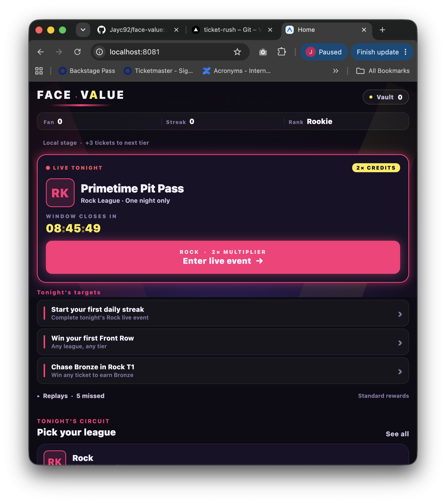
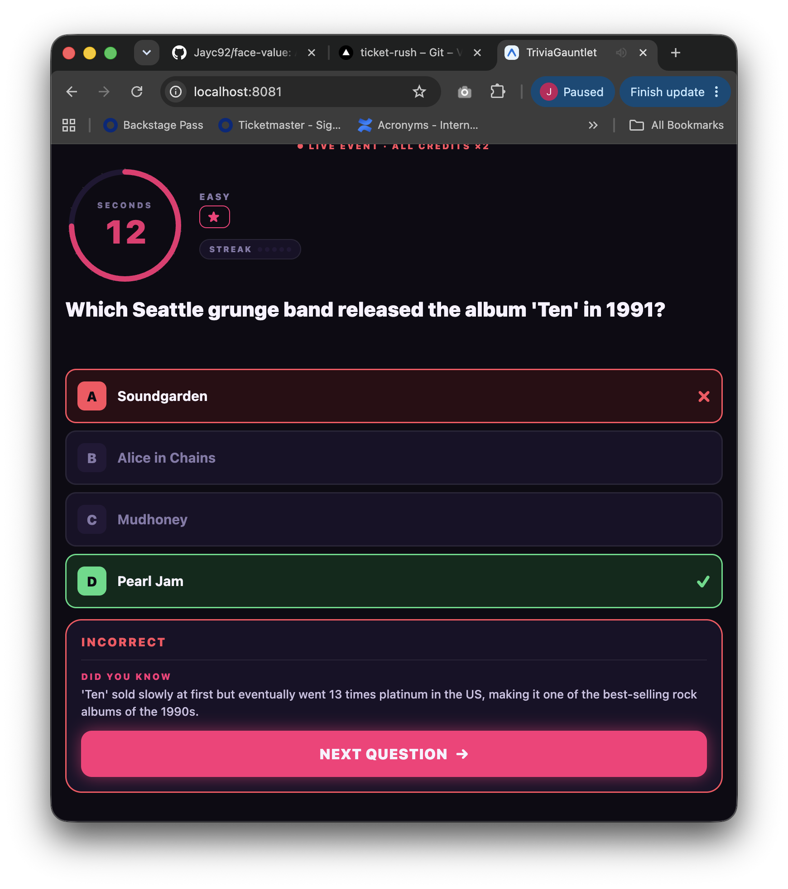

<h1 align="center">Face Value</h1>

<p align="center">
  <strong>Answer trivia, earn credits, and outbid AI rivals for front-row seats you keep forever.</strong>
</p>

<p align="center">
  
  
  
  
</p>

Face Value is a mobile-first, live music & sports trivia game. A fast trivia
gauntlet earns you **credits**; you spend those credits bidding against AI
rivals on the **Bidding Floor** for premium seats. Every seat you win becomes
a collectible ticket in your **Vault**, building medals, records, and daily
streaks along the way.

**Tech stack:** React Native · Expo (SDK 56) · TypeScript (strict) ·
React Navigation · Reanimated · react-native-svg · AsyncStorage.
Runs on iOS and Android via Expo Go. Local-only — no backend, no accounts.

## Screenshots

### Home



### Trivia



## Features

**Trivia** — 10 timed questions (15s each) across five leagues: Rock, Hip-Hop,
Pop, Country, Sports. Faster correct answers pay more; a 3+ streak lights the
Hype Multiplier (×1.5 → ×2 → ×3).

**Bidding** — Split your credits across Front Row, Mid Level, and Upper Deck
against AI rivals. Each tier has a hidden reserve, ties go to you, and losing
bids are refunded — allocation is a real strategic choice.

**Collection** — Won seats become premium ticket stubs in a persistent Vault.
Every ticket has a deterministic **rarity** (Standard → Prime → Collector →
Legendary → Live → Golden Ticket) and a **venue theme** (Club, Arena, Stadium,
Festival, Theater) that styles the stub. Completion is tracked per venue, per
league, and overall, with a staged ticket-reveal animation on Results.

**Progression** — Fan Score (total tickets) unlocks higher tiers. Bigger tiers
mean harder trivia, tougher rivals, and richer rewards.

**Retention** — Campaign medals, personal records, persistent achievements,
three deterministic daily challenges, daily live events, and daily streaks give
you a reason to come back tomorrow — all stored locally. Rival bidders have
recognizable personalities (front-runner, value hunter, balanced, opportunist).

## Gameplay Loop

```
League ──▶ Trivia ──▶ Credits ──▶ Auction ──▶ Ticket ──▶ Vault ──▶ Fan Score ──▶ Unlock higher tiers
```

Pick a league, run the trivia gauntlet to bank credits, bid on the Bidding
Floor, and claim a ticket. Tickets fill your Vault and raise your Fan Score,
which unlocks the next tier — where it all begins again at higher stakes.

## Project Status

**Completed**
- Tier 1 & Tier 2 gameplay
- Ticket Vault (persistent)
- Daily Live Events
- Campaign Medals
- Personal Records
- Daily Streaks
- Mobile UI overhaul

**In Progress**
- Tier 3 & Tier 4
- Multiplayer
- Cloud sync
- Native App Store release

## Roadmap

- [x] Trivia engine
- [x] Auction system
- [x] Ticket Vault
- [x] Daily Events
- [x] Medals
- [ ] Multiplayer
- [ ] Cloud Save
- [ ] Push Notifications
- [ ] TestFlight
- [ ] Google Play Internal Testing
- [ ] App Store Launch

## Repository Structure

```
face-value/
├── App.tsx          # Navigation stack + global providers
├── scripts/         # Deterministic balance & retention simulations
└── src/
    ├── screens/     # Home, LeagueSelect, Trivia, Bidding, Results, Vault, Settings
    ├── components/  # Reusable UI (buttons, cards, SeatMap, TicketCard, …)
    ├── game/        # Pure game logic: scoring, AI bidders, tiers, medals, records
    ├── data/        # Trivia question banks (one JSON file per league)
    ├── assets/      # Icons and fonts
    └── utils/       # Theme tokens, AsyncStorage, preferences, RNG, sounds
```

## Running Locally

```bash
npm install
npx expo start
```

Then press `i` (iOS Simulator), `a` (Android Emulator), or scan the QR code
with the Expo Go app on a device.

## Deploying to Vercel

Face Value exports to a static single-page web build (Expo web / Metro),
so it deploys to Vercel with no server. `vercel.json` is committed with the
correct settings, so importing the repo is one click — Vercel reads it
automatically.

Produce the build locally to verify:

```bash
npm install
npm run build:web   # → expo export --platform web, outputs to dist/
```

Deploy steps:

1. Push the repo to GitHub/GitLab.
2. In Vercel, **Add New → Project** and import the repo.
3. If prompted, set **Root Directory** to the project folder (`face-value`
   if the repo root is a monorepo; otherwise leave as `./`). The rest is
   read from `vercel.json`.
4. Click **Deploy**.

Vercel settings (already encoded in `vercel.json`):

| Setting | Value |
|---|---|
| Framework preset | **Other** (no framework) |
| Build command | `npm run build:web` |
| Output directory | `dist` |
| Install command | `npm install` |
| Root directory | `./` (the `face-value` project folder) |
| Environment variables | none required |

The SPA rewrite in `vercel.json` sends every path to `/` so a hard refresh
or shared deep link always boots the app. Everything is local-only
(AsyncStorage → browser localStorage on web); there is no backend, so no
env vars or secrets are needed.

> **Do not** set `EXPO_PUBLIC_ENABLE_DEV_FIXTURES` on the Vercel project —
> leaving it unset keeps Playtest Mode and dev shortcuts hidden in the
> deployed build.

## Playtesting

This build is a release candidate for external playtesting:

- [PLAYTESTING.md](PLAYTESTING.md) — what to play and what we want to learn
- [QA_CHECKLIST.md](QA_CHECKLIST.md) — full manual pass before a playtest
- [PLAYTEST_FEEDBACK.md](PLAYTEST_FEEDBACK.md) — tester questionnaire
- [.gitlab/issue_templates/Bug.md](.gitlab/issue_templates/Bug.md) — bug report template

---

## Developer Reference

<details>
<summary><strong>Verification & test scripts</strong></summary>

```bash
npx tsc --noEmit                          # type-check (strict)
npx expo export --platform ios            # iOS bundle
npx expo export --platform android        # Android bundle
npx tsx scripts/simulateAuction.ts        # 1000-sample auction balance
npx tsx scripts/simulateRetention.ts      # medals / streaks / records assertions
npx tsx scripts/testRoundIdempotency.ts   # round double-apply guards
npx tsx scripts/testCollectibles.ts       # rarity / venue / challenges / achievements
```
</details>

<details>
<summary><strong>Collectibles & daily systems</strong></summary>

- **Ticket rarity** (`src/game/rarity.ts`) — deterministic from a ticket's
  stored fields (seat, correctness, live). Ladder: Standard → Prime →
  Collector → Legendary → Live → Golden Ticket.
- **Venue themes** — every venue maps to Club / Arena / Stadium / Festival /
  Theater, which tints the ticket stub.
- **Daily challenges** (`src/game/challenges.ts`) — three deterministic
  goals seeded by the local date; progress lives in the profile and resets
  on date rollover.
- **Achievements** (`src/game/achievements.ts`) — persistent milestone
  unlocks evaluated against the post-round profile (unlock once).
- **Collection** (`src/game/collection.ts`) — completion per venue, per
  league, and overall, derived from the vault.

New AsyncStorage lives inside the existing `facevalue/playerProfile/v1`
key (added fields: `unlockedAchievementIds`, `dailyChallengeProgress`,
`dailyChallengeDate`, `dailyChallengeCompletedIds`). Tickets gained optional
`correctCount` / `totalQuestions` / `bestCombo` for stable rarity. All fields
migrate in with safe defaults — no existing data is lost.
</details>

<details>
<summary><strong>Dev fixtures (developers only)</strong></summary>

A `dev · 10/10` chip (Home) and a **Reset local data** button (Settings) are
double-gated behind `__DEV__ && process.env.EXPO_PUBLIC_ENABLE_DEV_FIXTURES === 'true'`,
so they stay hidden in ordinary Expo Go runs and exported builds. Enable
locally with:

```bash
EXPO_PUBLIC_ENABLE_DEV_FIXTURES=true npx expo start
```

> ⚠️ Do not enable dev fixtures for an external playtest.
</details>

<details>
<summary><strong>Adding trivia questions</strong></summary>

Question banks live in `src/data/<league>.json`. Adding questions to an
existing league needs no code changes — append objects of this shape:

```json
{
  "id": "rock-051",
  "league": "rock",
  "difficulty": "easy",
  "question": "Which band released the album 'Abbey Road'?",
  "choices": ["The Rolling Stones", "The Beatles", "The Who", "The Kinks"],
  "correctIndex": 1,
  "funFact": "Abbey Road's cover photo took just 10 minutes to shoot."
}
```

`difficulty` is `easy` | `medium` | `hard`, `choices` is exactly 4 strings,
and `correctIndex` is 0–3. Fun facts show after every answer.
</details>

<details>
<summary><strong>Design direction</strong></summary>

Themed around "ticket-night adrenaline" — dark glass surfaces, neon accents
used sparingly, tabular numerals on every value. Palette: near-black ink,
hot pink (`#FF2D78`), electric yellow (`#FFE94D`), with per-seat-tier accents
(Front = gold, Mid = pink, Upper = steel). Tokens live in `src/utils/theme.ts`.
</details>

## Notes & Limitations

- **Local-only (v1):** progress lives in AsyncStorage on the device — no
  accounts, cloud sync, or online leaderboards.
- **Daily streaks** use the device's local calendar date; changing the system
  clock or timezone can affect them.
- **Tiers 3 & 4** are visible but locked; only Tiers 1 and 2 are playable.
